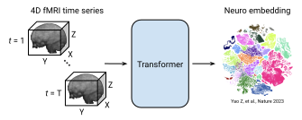
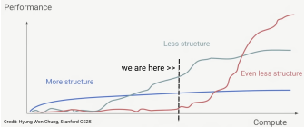
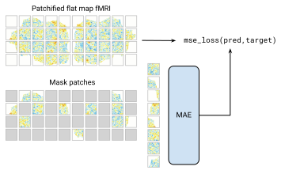

## Background

**Motivation.** Our goal is to train a foundation model for functional MRI (fMRI) data. The basic strategy is to leverage large-scale publicly available fMRI data to train models that can "decode" noisy fMRI data into structured, interpretable "neuro embeddings". In turn, we hope that these learned neuro embeddings will enable downstream tasks such as identifying early biomarkers of neurodegenerative disease, distinguishing subtypes of neuropsychiatric conditions, predicting an individual's response to specific mental health treatment, and decoding the contents of a person's perception.

  

In the past 2-3 years, we've seen growing interest around training deep learning "foundation" models on large-scale fMRI data. For example, [\[Thomas et al., NeurIPS 2022\]](https://proceedings.neurips.cc/paper_files/paper/2022/hash/8600a9df1a087a9a66900cc8c948c3f0-Abstract-Conference.html), [\[SwiFT, NeurIPS 2023\]](https://proceedings.neurips.cc/paper_files/paper/2023/hash/8313b1920ee9c78d846c5798c1ce48be-Abstract-Conference.html), [\[BrainLM, ICLR 2024\]](https://openreview.net/forum?id=RwI7ZEfR27), [\[Brain-JEPA, NeurIPS 2024\]](https://openreview.net/forum?id=gtU2eLSAmO), [\[BrainSymphony, ArXiv 2025\]](https://arxiv.org/abs/2506.18314), [\[NeuroSTORM, ArXiv 2025\]](https://arxiv.org/abs/2506.11167). One of the key decisions to make when designing an fMRI foundation model is how to format the data for input to the model. Most of the prior works use a parcellation based approach, where each 3D fMRI volume is first reduced to a fixed dimension vector by averaging the activity within a set of non-overlapping "parcels". But this dimensionality reduction from ~100K voxels to ~1K parcels inevitably loses information. Some works instead choose to preserve the full data fidelity by training models directly on the 4D volumetric fMRI data. But the 4D structure of fMRI data is complicated, and it's not clear that we currently have enough data and/or the right architectures and training objectives to learn all this structure.

  

**Approach.** Our current strategy is to take an intermediate approach that preserves the full dimensionality of the data, while removing some of the complexity of modeling fMRI in native 4D volumetric space. Specifically, we leverage a cortical *flat map* representation of the fMRI data. To format a 4D fMRI time series for input to the model, we first extract the data for the left and right cortical hemispheres, project the data to a cortical surface mesh, and finally flatten the 3D surface mesh to a 2D flat map. The result is a video of 2D flat map fMRI activity patterns. Crucially, all ~100K voxel fMRI time series are preserved by this transformation. They have just been reorganized into a representation that is more accessible to standard 2D image and 3D video modeling.

  

Our current model uses a vision transformer (ViT) architecture and masked autoencoding ([MAE](https://arxiv.org/abs/2111.06377), [MAE-st](https://arxiv.org/abs/2205.09113)) objective. Specifically, we first "patchify" the input flat map videos using a linear spatiotemporal patch embedding together with a learned spatiotemporal position encoding. We then pass a small random fraction of observed patches to the ViT encoder-decoder, which is trained to reconstruct the unobserved patches.

  

**Results and next steps.** We've so far seen strong performance on masked reconstruction and downstream decoding tasks (HCP cognitive task-state classification, NSD CLIP cluster classification) which improves with increasing model size up to ViT-B (86M params). Though we haven't yet established strong performance for subject-level downstream tasks such as clinical diagnosis prediction, or seen strong evidence for performance scaling with the amount of pretraining data.

  

We still have a lot of work to do refining our architecture and pretraining objective, tuning our training recipe, and implementing evaluations and ablations. In addition, we would like to explore variations in the training objective beyond vanilla MAE. We are tracking specific open project directions in our [github issues](https://github.com/SophontAI/fmri-fm/issues). If you're interested in getting involved, take a look there and see what could be of interest! Then just send a message in the Discord [#fmri-fm](https://discord.com/channels/1025299671226265621/1399064456662880257) channel to start discussing. See also our [contributing guide](CONTRIBUTING.md) for more details on the contribution process.
