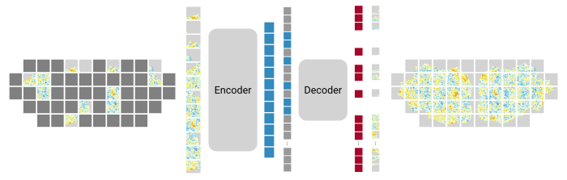

# MedARC - fMRI Foundation Model

[[`ArXiv (fm-MAE)`](https://arxiv.org/abs/2510.13768)]
[[`Discord`](https://discord.gg/tVR4TWnRM9)]
[[`Notion`](https://medarc.notion.site/fMRI-Foundation-Model-22082b7aafbc8078bbcad0eefb651c8c)]
[[`Intro video`](https://youtu.be/DtjUE9qg8jk)]

<p align="center">
  
</p>

Our goal is to train state-of-the-art foundation models for fMRI and unlock novel clinical applications for improving brain and mental health. This is an open community driven project where we share ideas, data, and compute. [Join our Discord](https://discord.com/invite/CqsMthnauZ) to get involved!

## Contributors

<!--
Add yourself when you make a PR in alphabetical order.
Feel free to use any link you like, doesn't have to be github.
If your info isn't right, pls open a PR to fix it.
-->
A (growing) list of our past and current contributors:
[@Atom-101](https://github.com/Atom-101),
[@ckadirt](https://github.com/ckadirt),
[@Dojo2024](https://github.com/Dojo2024),
[@har5h1l](https://github.com/har5h1l),
[@ks9249](https://github.com/ks9249),
[@Leema-Krishna-Murali](https://github.com/Leema-Krishna-Murali),
[@LeoYu](https://github.com/LeoYu),
[@Manishram-ai](https://github.com/Manishram-ai),
[@mihirneal](https://github.com/mihirneal),
[@MohammedSB](https://github.com/MohammedSB),
[@sagarigrandhi](https://github.com/sagarigrandhi),
[@souvik3333](https://github.com/souvik3333),
[@ss8319](https://github.com/ss8319),
[@Sue0515](https://github.com/Sue0515),
[@utxrsh](https://github.com/utxrsh),
[@yuxiangwei0808](https://github.com/yuxiangwei0808).
Thank you! 🤗

## Project overview

A key question for building fMRI foundation models is how to format or "tokenize" the native 4D volumetric fMRI data for model input. Most current approaches use either parcellation based averaging [[Brain-JEPA](https://openreview.net/forum?id=gtU2eLSAmO), [BrainLM](https://openreview.net/forum?id=RwI7ZEfR27)] or 4D volume convolution [[SwiFT](https://proceedings.neurips.cc/paper_files/paper/2023/hash/8313b1920ee9c78d846c5798c1ce48be-Abstract-Conference.html), [NeuroStorm](https://arxiv.org/abs/2506.11167)]. Our current work [[fm-MAE](https://arxiv.org/abs/2510.13768)] uses a novel [flat map](https://www.frontiersin.org/journals/neuroinformatics/articles/10.3389/fninf.2015.00023/full) based representation that is in between the two along the "bitter lesson continuum": more information rich than parcellation approaches, yet more structured than native 4D volume approaches.

<p align="center">
  
</p>

Another important axis for fMRI foundation models is the self-supervised learning objective. For our initial work, we picked the [MAE](https://arxiv.org/abs/2205.09113) objective for its simplicity.

<p align="center">
  
</p>

### Roadmap

Beyond flat maps, there are several other tokenization strategies we are interested in exploring:

- "vector" parcellation embeddings (cf [[Feng et al., 2025](https://arxiv.org/abs/2509.23566)])
- native surface mesh tokenization (cf [[Yu et al., 2025](https://arxiv.org/abs/2507.16389)])
- *sparse* gray matter only 4D volume patch embedding

Beyond MAE, there are many different types of SSL objectives we could try:

- Contrastive: [[SimCLR](https://arxiv.org/abs/2002.05709)]
- Self-distillation: [[SimSiam](https://arxiv.org/abs/2011.10566), [DINO](https://arxiv.org/abs/2104.14294)([v2](https://arxiv.org/abs/2304.07193),[v3](https://arxiv.org/abs/2508.10104)), [JEPA](https://arxiv.org/abs/2301.08243)]
- Reconstructive: [[AIM](https://arxiv.org/abs/2401.08541), [l-DAE](https://arxiv.org/abs/2401.14404)]
- Masked image modeling: [[CAPI](https://arxiv.org/abs/2502.08769)]

There is also a lot of work to do to set up a solid infrastructure for training and evaluating SOTA fMRI foundation models:

- assembling diverse large-scale pretraining datasets
- establishing reproducible benchmarks
- developing methods to interpret models' learned representations
- optimizing model training and inference

## Installation

Clone the repo, install [uv](https://docs.astral.sh/uv/getting-started/installation/), and run

```bash
uv sync
```

This will create a new virtual environment for the project with all the required dependencies. Activate the environment with

```bash
source .venv/bin/activate
```

or use `uv run`. See the [uv docs](https://docs.astral.sh/uv/getting-started/) for more details.

## Getting started

See our [quickstart notebook](notebooks/quickstart.ipynb) for a demo of loading an fm-MAE model and plotting masked predictions.

## Datasets

For datasets that allow open sharing, we release our preprocessed flat map datasets to [huggingface](https://huggingface.co/collections/medarc/fmri-fm-68ecda0734de98af9835e27d).

- [`hcp-flat-wds`](https://huggingface.co/datasets/medarc/hcp-flat-wds): [HCP-YA](https://www.humanconnectome.org/study/hcp-young-adult/document/1200-subjects-data-release) minimally preprocessed fMRI data converted to flat maps ([webdataset](https://github.com/webdataset/webdataset) format).

- [`nsd-flat-wds`](https://huggingface.co/datasets/medarc/nsd-flat-wds): [NSD](https://naturalscenesdataset.org/) preprocessed surface-mapped fMRI data converted to flat maps ([webdataset](https://github.com/webdataset/webdataset) format).

The datasets can be downloaded and used locally:

```python
from huggingface_hub import snapshot_download
from data.flat_data import make_flat_wds_dataset

# download first shard only
snapshot_download(
  repo_id="medarc/hcp-flat-wds", repo_type="dataset", allow_patterns="*_0000.tar", local_dir="datasets/hcp-flat"
)
url = "datasets/hcp-flat/hcp-flat_0000.tar"
dataset = make_flat_wds_dataset(url)
```

or streamed directly from huggingface:

```python
from huggingface_hub import get_token
from data.flat_data import make_flat_wds_dataset

# first ten shards
url = "https://huggingface.co/datasets/medarc/hcp-flat-wds/resolve/main/hcp-flat_{0000..0009}.tar"
hf_token = get_token()
url = f"pipe:curl -s -L {url} -H 'Authorization:Bearer {hf_token}'"

dataset = make_flat_wds_dataset(url)
```

We also share some misc data in a shared working data repo: [`medarc/fmri-fm`](https://huggingface.co/datasets/medarc/fmri-fm).

## Pretrained models

| model | arch | patch size (p-p<sub>t</sub>) | # params | pretrain data | weights |
| --- | --- | --- | --- | --- | --- |
| fm-MAE | ViT-B | 16-16 | 89M | HCP-YA | [download](https://huggingface.co/medarc/fm_mae_vit_base_patch16-16.hcp) |
| fm-MAE | ViT-B | 16-2 | 89M | HCP-YA | [download](https://huggingface.co/medarc/fm_mae_vit_base_patch16-2.hcp) |

We have uploaded an initial set of pretrained models to [huggingface](https://huggingface.co/collections/medarc/fmri-fm-68ecda0734de98af9835e27d). To load a pretrained model, you can run:

```python
from flat_mae.models_mae import MaskedAutoencoderViT

model = MaskedAutoencoderViT.from_pretrained("medarc/fm_mae_vit_base_patch16-16.hcp")
```

See the [quickstart notebook](notebooks/quickstart.ipynb) for an example of running masked prediction inference.

## Pretraining

To launch a debug pretraining run on one gpu, run:

```bash
uv run python src/flat_mae/main_pretrain.py \
  --cfg-path src/flat_mae/config/debug_pretrain.yaml
```

Or to run on cpu:

```bash
uv run python src/flat_mae/main_pretrain.py \
  --cfg-path src/flat_mae/config/debug_pretrain.yaml \
  --overrides device=cpu
```

To launch a full pretraining run on one gpu:

```bash
uv run python src/flat_mae/main_pretrain.py
```

Read the [`default_pretrain.yaml`](src/flat_mae/config/default_pretrain.yaml) config for a description of all the options.

## Codebase structure

The codebase follows a [flat organization](https://www.evandemond.com/programming/wide-and-flat) for (hopefully) easier forking and hacking. It contains the following modules which each have a flat layout and are independent from one another.

- [`data`](src/data): shared fMRI dataset code
- [`flat_mae`](src/flat_mae): model and pretraining code for flat map MAE (fm-MAE)

Additional documentation for each module can be found in the module README.

As the project progresses, the codebase will grow width-wise, with additional modules added to try out different approaches.

<!-- TODO: evaluation -->

## Contributing

This is a community-driven open science project. We welcome all contributions. To get started contributing, see our [contributing guide](CONTRIBUTING.md) and [code of conduct](CODE_OF_CONDUCT.md). Then take a look at our [open issues](https://github.com/MedARC-AI/fmri-fm/issues/).

## License

By default, code and model weights are released under a CC-BY-NC 4.0 license. See [LICENSE](LICENSE) for details. However, many of the individual source files are derived from third-party sources licensed under an Apache 2.0 or MIT license. In these cases, we preserve the original license. The relevant license for a particular source file (if different from the default) is indicated in the file header.
