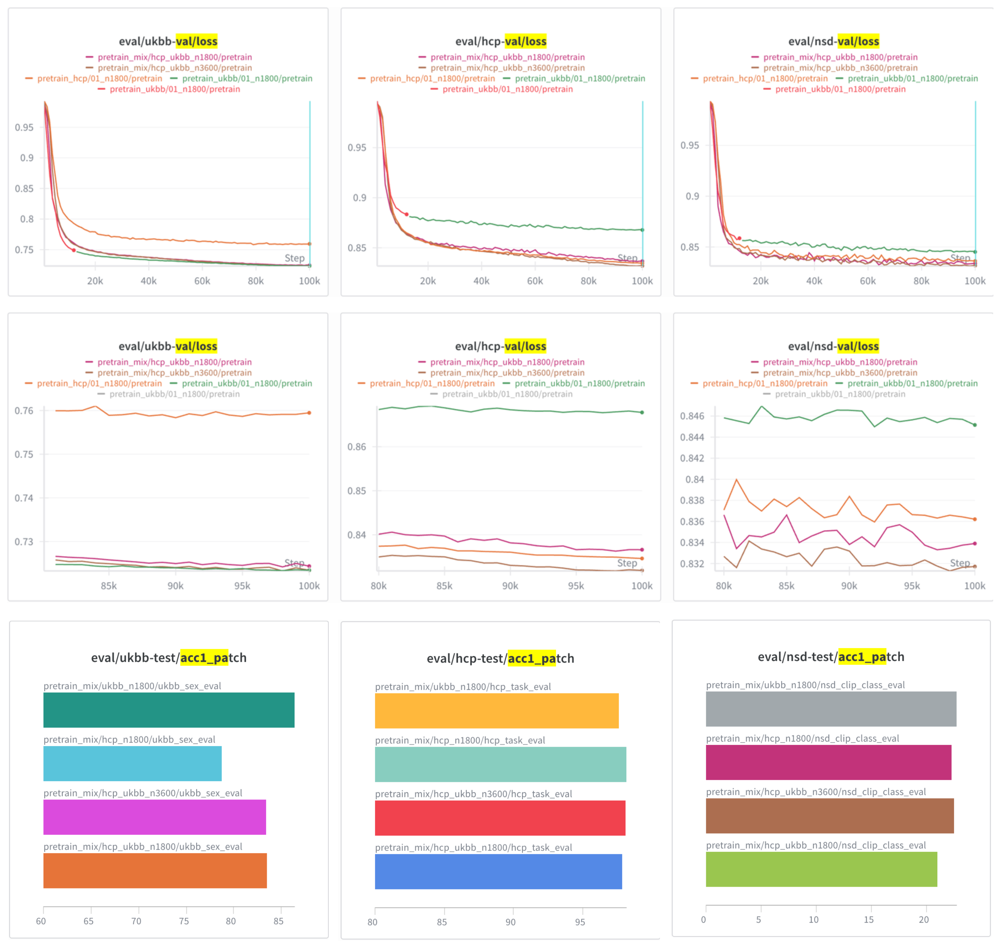

# Mixed HCP/UKBB pretraining

The goal of this experiment is to evaluate pretraining with mixed HCP/UKBB datasets.

## Setup

Pretraining data settings:
- `hcp_n1800`: all 1800 shards from HCP (current default)
- `ukbb_n1800`: first 1800 shards from UKBB
- `hcp_ukbb_1800`: first 900 from HCP + first 900 from UKBB
- `hcp_ukbb_3600`: all 1800 from HCP + first 1800 from UKBB

All runs use the same default pretraining recipe (ViT-B, t patch size = 16, bs 32, 625k steps)

## Results

  

- Single dataset models have much higher MAE loss on their respective OOD data (HCP -> UKBB, UKBB -> HCP). This shows that the models learn dataset specific patterns to help with MAE reconstruction.
- Pretraining on mixed datasets achieves good MAE performance on both datasets.
- Mixed pretrained models also have slightly better MAE performance on the OOD NSD dataset.
- For downstream probe, the single dataset models perform best on their in-distribution eval, followed by the mixed pretrain models.
- For the nsd eval, which is OOD for all models, the performance is pretty consistent. The only exception seems to be `hcp_ukbb_n1800`, which sees less data from each. Though this difference might not be reliable.

**Take-away.**

- UKBB pretraining works, similar to HCP pretraining.
- No evidence of a massive benefit to mixed dataset pretraining.
- TBD what happens if you pretrain on more data from UKBB, or train for longer.
